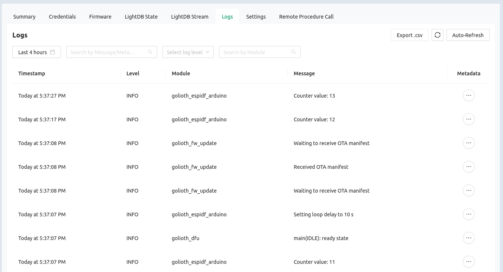

# Golioth ESP-IDF with Arduino as a component

This is an ESP-IDF project that demonstrates using the Arduino SDK alongside the
Golioth SDK. [Golioth device management](https://golioth.io/) is included using
the Golioth Firmware SDK which has native support for ESP-IDF. To enable Arduino
core (and some libraries), the Arduino core has also been included as an ESP-IDF
component. The repository targets the ESP32 family of chips.

## What is this all about?

The Espressif IoT Development Framework (ESP-IDF) is the company's official
development framework for the ESP32 family of chips. Espressif also maintains an
Arduino port for these parts. It is possible to use the Arduino core alongside
the ESP-IDF by building the core in as a component.

Golioth fully supports the ESP-IDF. As an experiment, we followed Espressif's
guide for using [Arduino as an ESP-IDF
Component](https://docs.espressif.com/projects/arduino-esp32/en/latest/esp-idf_component.html).
This repository is the result, demonstrating the use of Arduino functionality
alongside the Golioth features like Over-the-Air (OTA) firmware update, LightDB
State, LightDB Stream, remote logging, remote procedure call (RPC), and our
settings service.

While Golioth provides robust support for the ESP-IDF, use alongside the Arduino
core should be considered experimental.

## Installation

Prerequisite: [Install ESP-IDF](https://docs.espressif.com/projects/esp-idf/en/latest/esp32/get-started/)

**Important:** At the time of publication, Golioth has been tested to work with
ESP-IDF v4.4.2. Please [review our verified device
matrix](https://docs.platformio.org/en/latest/integration/ide/vscode.html) for
info on the most recently tested platforms.

1. Clone this repo to a folder where you like to keep your ESP-IDF projects

   ```shell
   git clone https://github.com/goliothlabs/golioth_espidf_arduino.git
   ```

2. Enter the folder and run the following commands:

   ```shell
   cd golioth_espidf_arduino
   git submodule update --init --recursive
   git clone https://github.com/hathach/tinyusb.git third_party/esp32-arduino-lib-builder/components/arduino_tinyusb/tinyusb
   ```

   **Note:** The `tinyusb` package needs to be added in the components directory
   of the ESP32 Arduino Lib Builder. Because the Lib Builder is already a
   submodule, we're directly cloning tinyusb into it. This is not ideal but it
   works. A more robust solution would be to clone those elsewhere (not as
   submodules) and update the CMakeLists.txt entry for tinyusb.

## Building and run the demo

This demo targets the ESP32. If you want to use a different chip (eg: ESP32-S2,
ESP32-C3) you should use the `idf.py set-target esp32xx` command before before
building the project.

1. Make a copy of `credentials.h_example` and rename it `credentials.h`. In this
   file you need to provide four credentials for this demo to run:

   * WiFi SSID
   * WiFi Password
   * Golioth Device PSK-ID
   * Golioth Device PSK

   **Note:** You can find your device credentials by visiting the
   [Golioth Web Console](https://console.golioth.io/).

2. Activate the ESP-IDF and build the project

   ```shell
   # Activate the ESP-IDF build environment
   source /path/to/your/esp-idf/export.sh

   # Optional, specify the target board (default is ESP32)
   idf.py set-target esp32

   # Build the project
   idf.py build

   # Flash the code to the device and monitor the output
   idf.py flash monitor
   ```

**Optional:** This program uses an LED attached to pin 23. This LED may be left
out, or remapped at the top of the app_main.c file.

## Expected Behavior

This demonstration can be described in three stages:

1. Establish a connection to WiFi (using the Arduino library) and to Golioth
2. Demonstrate the Arduino core syntax
   1. Print using `Serial.println()`
   2. Blink an LED using `DigitalWrite()`
   3. Loop using `delay()`
3. Demonstrate the Golioth SDK:
   1. Register for OTA firmware updates
   2. Send log messages to the server
   3. Record a counter to the server
   4. Monitor a setting on the server to establish the delay between counter
      loops

Typical output is as follows:

```shell
I (897) wifi:new:<6,0>, old:<1,0>, ap:<255,255>, sta:<6,0>, prof:1
I (898) wifi:state: init -> auth (b0)
I (905) wifi:state: auth -> assoc (0)
I (910) wifi:state: assoc -> run (10)
I (923) wifi:connected with golioth-staff, aid = 2, channel 6, BW20, bssid = c6:ff:d4:a8:fa:10
I (924) wifi:security: WPA2-PSK, phy: bgn, rssi: -43
I (931) wifi:pm start, type: 1

I (959) wifi:AP's beacon interval = 102400 us, DTIM period = 2
W (1235) wifi:<ba-add>idx:0 (ifx:0, c6:ff:d4:a8:fa:10), tid:0, ssn:1, winSize:64
.I (1687) esp_netif_handlers: sta ip: 192.168.1.157, mask: 255.255.255.0, gw: 192.168.1.1
.IP address: 
192.168.1.157
I (1891) golioth_mbox: Mbox created, bufsize: 2184, num_items: 20, item_size: 104
This is where Arduino loop() functions happen
Hello Golioth! #0
I (1914) golioth_coap_client: Start CoAP session with host: coaps://coap.golioth.io
I (1915) golioth_coap_client: Session PSK-ID: 20230105225905-platformio-test@ttgo-demo
I (1924) libcoap: Setting PSK key

I (1931) golioth_coap_client: Entering CoAP I/O loop
I (2146) golioth_coap_client: Golioth CoAP client connected
Hello Golioth! #1
Hello Golioth! #2
Hello Golioth! #3
Hello Golioth! #4
Hello Golioth! #5
Hello Golioth! #6
Hello Golioth! #7
Hello Golioth! #8
Hello Golioth! #9
Hello Golioth! #10
Let's break this loop and try out some Golioth features.

I (12902) golioth_fw_update: Current firmware version: 1.0.0
I (12910) golioth_espidf_arduino: Counter value: 11
I (13005) golioth_fw_update: Waiting to receive OTA manifest
I (13151) golioth_espidf_arduino: Setting loop delay to 10 s
I (13310) golioth_fw_update: Received OTA manifest
I (13313) golioth_fw_update: Manifest does not contain different firmware version. Nothing to do.
I (13316) golioth_fw_update: Waiting to receive OTA manifest
I (22912) golioth_espidf_arduino: Counter value: 12
I (32919) golioth_espidf_arduino: Counter value: 13
I (42926) golioth_espidf_arduino: Counter value: 14
...
```

## Working with Golioth Features

This example code illustrates four of the Golioth features:

* Over the Air (OTA) firmware update
* Logging
* LightDB State
* Settings Service

**NOTE:** The remaining Golioth features (Remote Procedure Call (RPC), LightDB
Stream, etc) are available but not implemented in this example. Please see [the
Golioth Basics example
code](https://github.com/golioth/golioth-firmware-sdk/blob/main/examples/common/golioth_basics.c)
for more information on how to use these features.

### Over the Air (OTA) firmware update

1. Build and upload the demo to your device.
2. Update the `_current_version` number in `src/app_main.cpp` to `1.0.1`
3. Rebuild the firmware but do not upload it to the device
4. Log into the [Golioth Console](https://console.golioth.io)
   1. Create a firmware artifact using 1.0.1 as the revision number and upload
      the `golioth_espidf_arduino.bin` found in the `build` folder.
   2. Create a release on Golioth using the artifact from the previous step.
   3. Roll out the new release and the device will immediately detect the
      new version.

**Note:** For more information on uploading firmware to Golioth, please [see the upload
section](https://blog.golioth.io/how-to-do-esp32-ota-updates-using-golioth-and-esp-idf/#upload-to-golioth)
of our post on ESP32 OTA.

```shell
I (12957) golioth_fw_update: Current firmware version: 1.0.0
I (12966) golioth_espidf_arduino: Counter value: 11
I (13062) golioth_fw_update: Waiting to receive OTA manifest
I (13129) golioth_espidf_arduino: Setting loop delay to 10 s
I (13431) golioth_fw_update: Received OTA manifest
I (13433) golioth_fw_update: Current version = 1.0.0, Target version = 1.0.1
I (13435) golioth_fw_update: State = Downloading
I (13784) golioth_fw_update: Image size = 947456
I (13786) golioth_fw_update: Getting block index 0 (1/926)
I (14153) fw_update_esp_idf: Writing to partition subtype 17 at offset 0x1a0000
I (14154) fw_update_esp_idf: Erasing flash
I (18931) golioth_fw_update: Getting block index 1 (2/926)
I (19068) golioth_fw_update: Getting block index 2 (3/926)
I (19180) golioth_fw_update: Getting block index 3 (4/926)
I (19288) golioth_fw_update: Getting block index 4 (5/926)
...
```

### Logging

Log messages can be sent to the Golioth servers. This feature is enabled by the
`CONFIG_GOLIOTH_AUTO_LOG_TO_CLOUD=1` present in the `sdkconfig.defaults` file.
Any messages generated using the `GLTH_LOGX()` macros will appear in the Logs
tab when viewing this device on the [Golioth
Console](https://console.golioth.io):



### LightDB State

The counter value in the loop of the demo program is being reported to the
server using Golioth LightDB State. This value can be viewed in the [Golioth
Console](https://console.golioth.io) by navigating to the Devices page,
selecting your device, then selecting the LightDB State tab:


### Settings Service

The delay value in the final loop of app_main.cpp can be configured remotely
using the Golioth Settings service. The `LOOP_DELAY_S` key must first be added
at the project level using the [Golioth
Console](https://console.golioth.io). Once the key (and default value) has been
created, it may be overridden at the Blueprint or the Device level:


